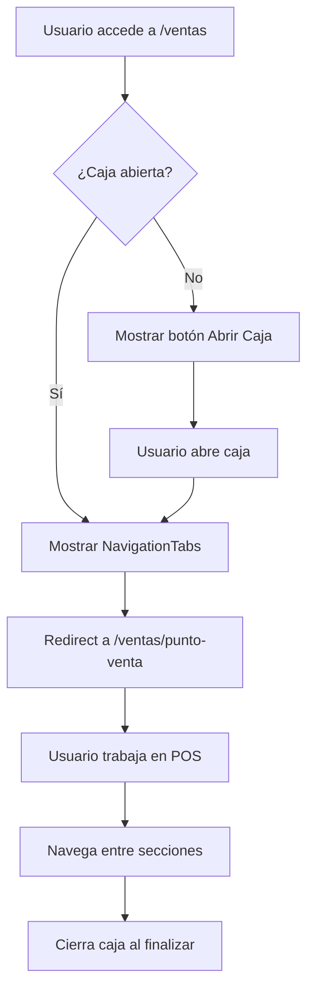

# 🏪 Módulo de Ventas - Arquitectura con Routing

> **Fecha de actualización:** 4 de febrero de 2026  
> **Versión:** 2.0.0 (Reestructurado con Routing)

## 📁 Estructura del Proyecto

```
ventas/
│
├── 📂 shared/                              # Recursos compartidos
│   ├── services/
│   │   ├── caja-state.service.ts          ⭐ Estado de caja (Signals)
│   │   └── ventas-state.service.ts        ⭐ Estado de ventas (Signals)
│   ├── guards/
│   │   └── caja.guard.ts                  🛡️ Protección de rutas
│   └── components/
│       └── navigation-tabs/               🧭 Navegación visual
│
├── 📂 ventas-layout/                       🏗️ Layout principal
│   ├── ventas-layout.component.ts
│   ├── ventas-layout.component.html
│   └── ventas-layout.component.scss
│
├── 📂 punto-venta/                         🛒 Ruta: /ventas/punto-venta
│   └── punto-venta.component.ts
│
├── 📂 historial/                           📜 Ruta: /ventas/historial
│   └── historial.component.ts
│
├── 📂 reportes/                            📊 Ruta: /ventas/reportes
│   └── reportes.component.ts
│
├── 📂 configuracion-ventas/                ⚙️ Ruta: /ventas/configuracion
│   └── configuracion-ventas.component.ts
│
├── 📂 realizar-venta/                      ⚠️ DEPRECATED (mantener temp.)
│   └── ...
│
├── 📂 clientes/                            👥 Gestión de clientes
│   └── ...
│
└── ventas-routing.module.ts                🗺️ Configuración de rutas
```

## 🎯 Rutas Disponibles

| Ruta | Componente | Guard | Descripción |
|------|-----------|-------|-------------|
| `/ventas` | `VentasLayoutComponent` | `AuthGuard` | Layout principal |
| `/ventas/punto-venta` | `PuntoVentaComponent` | `CajaGuard` | Sistema POS |
| `/ventas/historial` | `HistorialComponent` | `CajaGuard` | Historial de ventas |
| `/ventas/reportes` | `ReportesVentasComponent` | `CajaGuard` | Analytics y reportes |
| `/ventas/configuracion` | `ConfiguracionVentasComponent` | `CajaGuard` | Configuración |
| `/ventas/clientes` | `ClientesComponent` | `AuthGuard` | Gestión de clientes |

## 🔑 Servicios Principales

### 1️⃣ CajaStateService

Gestiona el estado de la caja registradora.

```typescript
// Métodos principales
abrirCaja(montoInicial, usuario)
cerrarCaja()
registrarVenta(monto)
actualizarEstadisticas(total, cantidad)
isCajaAbierta(): boolean

// Signals (reactive)
cajaAbierta()
totalVentasDelDia()
cantidadVentas()
promedioVenta()
```

### 2️⃣ VentasStateService

Gestiona el estado de las ventas.

```typescript
// Métodos principales
setVentas(ventas)
agregarVenta(venta)
actualizarVenta(venta)
eliminarVenta(id)
setFiltros(filtros)
limpiarFiltros()

// Signals (reactive)
ventas()
ventasFiltradas()
ventasPendientes()
ventasDelDia()
totalVentasDelDia()
estadisticas()
```

## 🛡️ Guards

### CajaGuard

Protege las rutas que requieren caja abierta.

```typescript
canActivate(): boolean
canActivateChild(): boolean

// Comportamiento:
// ✅ Caja abierta → Permite acceso
// ❌ Caja cerrada → Muestra mensaje + Redirect
```

## 🧭 Navegación

### NavigationTabsComponent

Componente de navegación visual entre secciones.

**Props:**
- `carritoCount`: Número de items en carrito
- `ventasPendientes`: Ventas pendientes de pago
- `configPendientes`: Configuraciones pendientes
- `totalVenta`: Total de venta actual
- `ventasCount`: Total de ventas

**Características:**
- Tabs con RouterLinkActive
- Badges dinámicos con animaciones
- Indicadores de estado
- Responsive design

## 🔄 Flujo de Trabajo



## 📊 Arquitectura de Estado

```
┌─────────────────────────────────────┐
│      VentasLayoutComponent          │
│  (Container con router-outlet)      │
└─────────────────┬───────────────────┘
                  │
        ┌─────────┴─────────┐
        │                   │
        ▼                   ▼
┌───────────────┐   ┌───────────────┐
│ CajaState     │   │ VentasState   │
│ Service       │   │ Service       │
└───────┬───────┘   └───────┬───────┘
        │                   │
        └─────────┬─────────┘
                  │
        ┌─────────┴─────────┐
        │                   │
        ▼                   ▼
┌───────────────┐   ┌───────────────┐
│ PuntoVenta    │   │ Historial     │
│ Component     │   │ Component     │
└───────────────┘   └───────────────┘
        ▼                   ▼
┌───────────────┐   ┌───────────────┐
│ Reportes      │   │ Configuracion │
│ Component     │   │ Component     │
└───────────────┘   └───────────────┘
```

## 🚀 Inicio Rápido

### 1. Acceder al módulo

```typescript
// En app.routes.ts
{
  path: 'ventas',
  loadChildren: () => import('./app/features/ventas/ventas-routing.module')
    .then(m => m.VentasRoutingModule)
}
```

### 2. Abrir caja

```typescript
import { CajaStateService } from './shared/services/caja-state.service';

constructor(private cajaState: CajaStateService) {}

abrirCaja() {
  this.cajaState.abrirCaja(100, 'usuario@email.com');
}
```

### 3. Navegar entre secciones

```typescript
import { Router } from '@angular/router';

constructor(private router: Router) {}

irAPOS() {
  this.router.navigate(['/ventas/punto-venta']);
}
```

### 4. Trabajar con ventas

```typescript
import { VentasStateService } from './shared/services/ventas-state.service';

constructor(private ventasState: VentasStateService) {}

agregarVenta(venta: VentaResponse) {
  this.ventasState.agregarVenta(venta);
  this.cajaState.registrarVenta(venta.total);
}
```

## ✨ Ventajas de la Nueva Arquitectura

| Característica | Antes | Ahora |
|---------------|-------|-------|
| **URLs navegables** | ❌ | ✅ |
| **Lazy loading** | ❌ | ✅ |
| **Historial del navegador** | ❌ | ✅ |
| **SEO friendly** | ❌ | ✅ |
| **Deep linking** | ❌ | ✅ |
| **Componentes standalone** | ❌ | ✅ |
| **Estado centralizado** | ❌ | ✅ |
| **Guards de protección** | Parcial | ✅ |
| **Testing unitario** | Difícil | Fácil |
| **Mantenibilidad** | Baja | Alta |

## 📝 Notas Importantes

### ⚠️ Componente Antiguo (realizar-venta)

El componente `realizar-venta` está **deprecado** pero se mantiene temporalmente en la ruta `/ventas/realizar-venta-old` para compatibilidad. Se recomienda no usarlo en desarrollo nuevo.

### 🔄 Migración de Código Existente

Si tienes código que usa `activeTabIndex`:

```typescript
// ❌ Antes
this.activeTabIndex = 1;

// ✅ Ahora
this.router.navigate(['/ventas/historial']);
```

### 💾 Persistencia de Estado

El estado de caja se guarda automáticamente en `localStorage`:
- Se restaura al recargar la página
- Se limpia al cerrar caja
- Incluye totales y estadísticas

## 🧪 Testing

```bash
# Ejecutar tests
ng test

# Tests específicos
ng test --include='**/caja-state.service.spec.ts'
ng test --include='**/caja.guard.spec.ts'
```

## 📚 Documentación Adicional

- [Guía Rápida](../../Documentos.md/GUIA_RAPIDA_NUEVA_ESTRUCTURA_VENTAS.md)
- [Documentación Técnica](../../Documentos.md/REESTRUCTURACION_VENTAS_ROUTING.md)
- [Angular Router Guide](https://angular.io/guide/router)
- [Angular Signals Guide](https://angular.io/guide/signals)

## 🤝 Contribuir

Al trabajar en este módulo:

1. ✅ Usar los servicios de estado compartido
2. ✅ Crear componentes standalone cuando sea posible
3. ✅ Proteger rutas sensibles con guards
4. ✅ Documentar cambios importantes
5. ✅ Escribir tests unitarios

## 📞 Soporte

Para dudas o problemas:

1. Revisa la documentación en `/Documentos.md/`
2. Verifica la consola del navegador
3. Asegúrate de que la caja esté abierta
4. Consulta los ejemplos de código

---

**Desarrollado con ❤️ por el equipo de desarrollo**  
**Última actualización:** 4 de febrero de 2026
